<div align="center">

# Manual de Instalación y Configuración de un Sistema Gestor de Base de Datos (PostgreSQL) en Linux Mint Cinnamon

</div>

<div align="justify">

 Asignatura : Bases de Datos   

 Docente : Gabriel Hurtado Avilés   

 Alumno : Valencia Villanueva Adrian   

 Grupo : 3BV1   

 Fecha de entrega : 15/09/2026 


## Índice

1. [Introducción](#1-introducción)
2. [Método 1: Despliegue con Docker](#2-método-1-despliegue-con-docker)
3. [Método 2: Instalación tradicional (nativa) con APT](#3-método-2-instalación-tradicional-nativa-con-apt)
4. [Prueba de fuego: Conexión mediante cliente gráfico](#4-prueba-de-fuego-conexión-mediante-cliente-gráfico)
5. [Conclusiones](#5-conclusiones)
6. [Referencias](#6-referencias)
7. [Anexo: Glosario de comandos y banderas](#7-anexo-glosario-de-comandos-y-banderas)


## 1. Introducción

### 1.1 Objetivo

Explicar los dos procedimientos distintos para poner en operación el sistema gestor de base de datos PostgreSQL sobre el sistema operativo Linux Mint Cinnamon, así como comprobar su correcto funcionamiento mediante un cliente gráfico y contrastar las ventajas técnicas de cada procedimiento.

### 1.2 ¿Qué es un Sistema Gestor de Base de Datos (SGBD)?

Un **Sistema Gestor de Base de Datos** (SGBD, o *DBMS* por sus siglas en inglés) es un programa que se coloca entre el usuario y los archivos donde viven los datos. En lugar de que un programador abra archivos y los lea byte por byte, el SGBD ofrece un lenguaje de consulta (en este caso **SQL**) y se encarga por su cuenta de tareas críticas: guardar los datos en disco, indexarlos para encontrarlos rápido, permitir que muchos usuarios escriban al mismo tiempo sin corromper la información, y garantizar que una operación se complete o no se realice en absoluto.

> ### DATO...
> Esa última garantía se conoce como **propiedades ACID**: **A**tomicidad (una operación se ejecuta completa o no se ejecuta), **C**onsistencia (la base nunca queda en un estado que viole sus propias reglas), **A**islamiento (*Isolation*: las transacciones simultáneas no se estorban entre sí) y **D**urabilidad (una vez confirmado un cambio, sobrevive incluso a un corte de energía). PostgreSQL cumple las cuatro.

### 1.3 ¿Qué es PostgreSQL?

**PostgreSQL** (pronunciado *post-gres-cu-ele*, y llamado coloquialmente "Postgres") es un sistema gestor de bases de datos **relacional y objeto-relacional**, de **código abierto** y desarrollado por una comunidad global desde 1996, con raíces en el proyecto POSTGRES de la Universidad de California en Berkeley (1986).

Sus características técnicas más relevantes son:

- **Relacional.** La información se organiza en *tablas* (filas y columnas) que se vinculan entre sí mediante *llaves primarias* y *llaves foráneas*.
- **Objeto-relacional.** Además del modelo clásico, permite definir tipos de dato propios, herencia de tablas y funciones personalizadas.
- **Arquitectura cliente-servidor.** PostgreSQL funciona como un **servidor**: un proceso que permanece encendido escuchando peticiones. Los programas que le hacen preguntas se llaman **clientes**. Esta separación es la razón por la que más adelante podremos conectarnos desde un programa gráfico externo.
- **Multiproceso.** Por cada conexión de cliente, el servidor lanza un proceso hijo dedicado.
- **Extensible.** Admite complementos como PostGIS (datos geográficos) o pgvector (búsqueda vectorial).
- **Licencia permisiva.** Se distribuye bajo la Licencia PostgreSQL, similar a BSD/MIT: se puede usar comercialmente sin pagar regalías.

> ### DATO...
> Al proceso servidor de PostgreSQL se le llama históricamente **`postmaster`**, y al conjunto de archivos donde guarda físicamente los datos se le llama **clúster de bases de datos** o **`PGDATA`**. Un solo clúster puede contener muchas bases de datos distintas. En Linux, `PGDATA` suele ubicarse en `/var/lib/postgresql/`.

### 1.4 Conceptos previos indispensables

Antes de comenzar, explicaré los términos que se usarán a lo largo del manual:

**Puerto:** Una computadora tiene una sola dirección de red (IP), pero puede correr muchos servicios a la vez. El **puerto** es un número de 0 a 65535 que funciona como el "número de departamento" dentro de ese edificio, identifica a qué programa concreto va dirigida una conexión. PostgreSQL usa por convención el **puerto 5432**. Un puerto solo puede estar ocupado por un programa a la vez.

**Proceso y servicio (demonio):** Un **proceso** es un programa en ejecución. Un **servicio** o **demonio** es un proceso que corre en segundo plano, sin ventana ni interacción directa, normalmente arrancado por el sistema operativo al encender el equipo. El servidor PostgreSQL es un demonio.

**Gestor de paquetes:** Un programa que descarga, instala, actualiza y desinstala software resolviendo automáticamente sus dependencias (las bibliotecas que ese software necesita). En Linux Mint que se basa en Ubuntu, que a su vez se basa en Debian, el gestor de paquetes es **APT** (*Advanced Package Tool*) y los paquetes tienen extensión `.deb`.

**Repositorio:** Un servidor en Internet que aloja paquetes firmados digitalmente. APT no descarga software de páginas web al azar, si no que, consulta una lista de repositorios autorizados definida en `/etc/apt/sources.list` y `/etc/apt/sources.list.d/`.

**Virtualización:** Es una técnica que permite ejecutar un sistema aislado dentro de otro. Existen dos grandes familias, y distinguirlas es el corazón de este manual.

### 1.5 Diferencia técnica entre contenedores e instalación nativa

#### 1.5.1 Instalación nativa

En una **instalación nativa**, el software se integra directamente en el sistema operativo anfitrión. El gestor de paquetes coloca los archivos ejecutables en `/usr/lib/postgresql/`, la configuración en `/etc/postgresql/`, los datos en `/var/lib/postgresql/`, crea un usuario de sistema llamado `postgres` y registra un servicio en **systemd** para que arranque automáticamente.

El programa comparte con el resto del sistema: el mismo kernel, las mismas bibliotecas del sistema (`libc`, `openssl`, etc.), el mismo árbol de directorios y los mismos puertos.

- **Ventaja:** Máximo rendimiento, cero capas intermedias y una integración natural con las herramientas del sistema.
- **Desventaja:** Solo puede existir cómodamente una configuración a la vez. Si un proyecto exige PostgreSQL 14 y otro exige PostgreSQL 17, se entra en un conflicto de versiones. Además, desinstalar deja residuos (archivos de configuración, usuario del sistema, datos huérfanos).

#### 1.5.2 Máquina virtual

Una **máquina virtual** (VirtualBox, VMware) emula hardware completo y ejecuta **un sistema operativo entero** encima, con su propio kernel. Aísla perfectamente, pero cuesta caro: gigabytes de disco, cientos de megabytes de RAM reservados y un arranque de decenas de segundos.

#### 1.5.3 Contenedor

Un **contenedor** es un proceso normal del sistema anfitrión al que el kernel de Linux le ha mentido sobre el mundo que lo rodea. No emula hardware ni incluye un kernel propio: **reutiliza el kernel de Linux Mint**. El aislamiento se consigue con dos mecanismos nativos del kernel:

- **Namespaces (espacios de nombres):** Hacen que el proceso vea su propio sistema de archivos, su propia lista de procesos (donde él es el proceso número 1), su propia red y su propio nombre de host. El contenedor "cree" que está solo en la máquina.
- **cgroups (grupos de control):** Limitan cuánta CPU, memoria y entrada/salida de disco puede consumir ese proceso.

Por eso un contenedor pesa decenas o cientos de megabytes en lugar de gigabytes, arranca en fracciones de segundo y consume casi la misma memoria que el programa que contiene.

> ### DATO...
> A los contenedores se les llama "virtualización a nivel de sistema operativo" o **virtualización ligera**, precisamente porque **no virtualizan el hardware ni duplican el kernel**. Esa es la diferencia técnica esencial frente a una máquina virtual, y la razón por la que en una laptop modesta pueden correr veinte contenedores pero difícilmente dos máquinas virtuales.

#### 1.5.4 Cuadro comparativo

| Criterio | Instalación nativa (APT) | Contenedor (Docker) | Máquina virtual |
|---|---|---|---|
| Kernel | El del anfitrión | El del anfitrión (compartido) | Uno propio, emulado |
| Peso en disco | ~50–200 MB | ~150–450 MB (imagen) | 5–20 GB |
| Tiempo de arranque | Segundos | Menos de 1 segundo | Decenas de segundos |
| Aislamiento | Nulo | Alto (namespaces + cgroups) | Total |
| Versiones simultáneas | Difícil | Trivial | Posible pero costoso |
| Eliminación limpia | Deja residuos | Completa (`docker compose down -v`) | Completa |
| Reproducibilidad | Manual, depende del equipo | Declarativa (archivo versionable) | Manual |

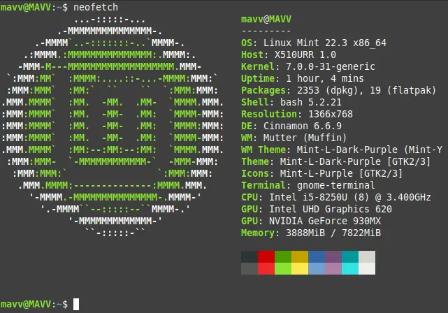  
**Figura 1. Información del Sistema de Linux Mint empleado.**

## 2. Método 1: Despliegue con Docker

### 2.1 ¿Qué es Docker?

**Docker** es una plataforma que automatiza la creación y ejecución de contenedores. Se apoya en tres conceptos que conviene no confundir:

- **Imagen:** Una plantilla inmutable de solo lectura: un sistema de archivos empaquetado con el programa ya instalado y sus dependencias. Es el "molde". Ejemplo: la imagen oficial `postgres:17`.
- **Contenedor:** Una instancia en ejecución de una imagen. Es el "producto salido del molde". De una misma imagen se pueden crear muchos contenedores.
- **Registro:** Un repositorio en línea de imágenes. El público por defecto es **Docker Hub**.

> ### DATO...
> Las imágenes de Docker están formadas por **capas** apiladas. Si dos imágenes distintas parten de la misma base (por ejemplo: Debian), esa capa se descarga y se almacena **una sola vez** en el disco. Por eso el consumo real de espacio suele ser mucho menor que la suma de los tamaños anunciados.

### 2.2 Instalación de Docker en Linux Mint

Linux Mint deriva de Ubuntu, pero **usa nombres clave (*codename*) propios** como *wilma*, *xia* o *virginia*, mientras que el repositorio oficial de Docker solo publica paquetes para los nombres clave de Ubuntu (*noble*, *jammy*, etc.). Por eso el procedimiento estándar de Ubuntu falla en Mint si no se hace la corrección que se explicaré en el paso 3.

#### Paso 1: Actualizar el índice de paquetes e instalar prerrequisitos

```bash
sudo apt update
sudo apt install -y ca-certificates curl gnupg
```

| Elemento | Significado |
|---|---|
| `sudo` | *SuperUser DO*. Ejecuta el comando con privilegios de administrador (root). Pedirá la contraseña del usuario. Instalar software modifica directorios del sistema, por eso es obligatorio. |
| `apt` | El gestor de paquetes de Linux Mint. |
| `update` | **No actualiza programas.** Descarga la lista actualizada de qué paquetes y qué versiones existen en los repositorios configurados; es decir, refresca el catálogo local. Sin este paso, APT podría intentar bajar una versión que ya no existe en el servidor y fallar con un error 404. |
| `install` | Descarga e instala los paquetes indicados junto con sus dependencias. |
| `-y` | Bandera de *yes*. Responde "sí" automáticamente a la pregunta de confirmación `¿Desea continuar? [S/n]`, lo que permite ejecutar el comando sin supervisión. |
| `ca-certificates` | Paquete con los certificados raíz de las autoridades certificadoras, permite validar conexiones HTTPS. |
| `curl` | Herramienta de línea de comandos para descargar archivos desde una URL. |
| `gnupg` | Implementación de GPG, usada para verificar firmas criptográficas de los paquetes. |

> ### DATO...
> Una **bandera** (*flag*) u **opción** es un modificador del comportamiento de un comando. Las cortas usan un guion y una letra (`-y`), las largas usan dos guiones y una palabra (`--yes`). Varias banderas cortas pueden combinarse: `-it` equivale a `-i -t`.

#### Paso 2: Registrar la llave GPG oficial de Docker

```bash
sudo install -m 0755 -d /etc/apt/keyrings
curl -fsSL https://download.docker.com/linux/ubuntu/gpg | sudo gpg --dearmor -o /etc/apt/keyrings/docker.gpg
sudo chmod a+r /etc/apt/keyrings/docker.gpg
```

| Elemento | Significado |
|---|---|
| `install -m 0755 -d` | Aquí `install` **no es APT**, sino el comando de Unix que crea archivos o directorios con permisos específicos. `-d` indica que se cree un *directorio*, `-m 0755` fija los permisos (lectura/escritura/ejecución para el dueño, lectura y ejecución para los demás). |
| `curl -fsSL <url>` | Descarga la llave pública. `-f` (*fail*) hace que devuelva error en lugar de imprimir la página de error del servidor, `-s` (*silent*) oculta la barra de progreso, `-S` (*show-error*) reactiva la impresión de errores reales, `-L` (*location*) sigue las redirecciones HTTP. |
| `\|` | **Tubería** (*pipe*). Toma la salida del comando de la izquierda y la entrega como entrada al de la derecha, sin crear archivos intermedios. |
| `gpg --dearmor` | Convierte la llave del formato de texto ASCII (*armored*) al formato binario que APT espera. |
| `-o <ruta>` | *Output*: Define el archivo de salida. |
| `chmod a+r` | *Change mode*: Otorga permiso de lectura (`+r`) a todos los usuarios (`a`, de *all*), para que APT pueda leer la llave. |

**Finalidad:** Esta llave permite que APT verifique que los paquetes que descargará fueron firmados realmente por Docker Inc. y no fueron alterados en tránsito.

#### Paso 3: Añadir el repositorio de Docker para Linux Mint

```bash
echo "deb [arch=$(dpkg --print-architecture) signed-by=/etc/apt/keyrings/docker.gpg] https://download.docker.com/linux/ubuntu $(. /etc/os-release && echo "$UBUNTU_CODENAME") stable" | sudo tee /etc/apt/sources.list.d/docker.list > /dev/null
sudo apt update
```

| Elemento | Significado |
|---|---|
| `echo "..."` | Imprime en pantalla el texto entre comillas: la línea de configuración del repositorio. |
| `deb` | Tipo de repositorio: paquetes binarios `.deb`. |
| `arch=$(dpkg --print-architecture)` | `$( )` ejecuta un comando y sustituye el resultado en su lugar. `dpkg --print-architecture` devuelve la arquitectura del procesador (normalmente `amd64`, o `arm64` en equipos ARM). |
| `signed-by=` | Indica a APT con qué llave debe validar la firma de este repositorio en concreto. |
| `$(. /etc/os-release && echo "$UBUNTU_CODENAME")` | **Esta es la corrección para Mint.** El punto (`.`) carga el archivo `/etc/os-release` como si fueran variables de la terminal, de ahí se extrae `UBUNTU_CODENAME`, que contiene el nombre clave de la versión de *Ubuntu* en la que se basa Mint, en vez del nombre clave de Mint. Si se usara `lsb_release -cs` como indican los tutoriales de Ubuntu se obtendría `wilma` o `xia`, y el repositorio devolvería un error 404. |
| `stable` | Canal del repositorio (versiones estables). |
| `tee <archivo>` | Escribe lo que recibe por la tubería **tanto en pantalla como en el archivo indicado**. Se usa con `sudo` porque escribir en `/etc/` requiere privilegios. |
| `> /dev/null` | Redirige la salida en pantalla al "agujero negro" del sistema, para que la terminal no se ensucie con la repetición del texto. |

El segundo `sudo apt update` es indispensable, sin él, APT desconocería el repositorio recién añadido.

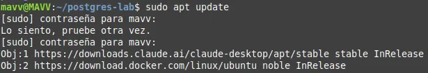  
**Figura 2. Evidencia de la adición del repositorio de Docker.**

#### Paso 4: Instalar el motor de Docker y sus complementos

```bash
sudo apt install -y docker-ce docker-ce-cli containerd.io docker-buildx-plugin docker-compose-plugin
```

| Paquete | Función |
|---|---|
| `docker-ce` | *Docker Community Edition*: el demonio (`dockerd`), el servicio que realmente crea y administra los contenedores. |
| `docker-ce-cli` | La interfaz de línea de comandos: el programa `docker` que se escribe en la terminal y que envía órdenes al demonio. |
| `containerd.io` | El *runtime* de contenedores de bajo nivel, que dialoga directamente con el kernel. |
| `docker-buildx-plugin` | Constructor avanzado de imágenes. |
| `docker-compose-plugin` | Añade el subcomando `docker compose`, necesario para la sección 2.4. |

#### Paso 5: Verificar la instalación y habilitar el uso sin `sudo`

```bash
sudo docker run --rm hello-world
sudo usermod -aG docker $USER
newgrp docker
```

| Elemento | Significado |
|---|---|
| `docker run` | **Crea y arranca** un contenedor a partir de una imagen. Si la imagen no está en el disco, la descarga automáticamente. |
| `--rm` | *Remove*: Elimina el contenedor en cuanto termina de ejecutarse, para no dejar basura. |
| `hello-world` | Imagen oficial de prueba: solo imprime un mensaje y termina. |
| `usermod -aG docker $USER` | *User modify*: `-a` (*append*) añade sin borrar los grupos previos, omitirlo podría dejar al usuario fuera de `sudo`, `-G` indica los grupos secundarios y `$USER` es la variable que contiene el nombre del usuario actual. |
| `newgrp docker` | Aplica la pertenencia al nuevo grupo en la terminal actual, sin necesidad de cerrar sesión. |

> ### DATO...
> Pertenecer al grupo `docker` equivale a tener privilegios de administrador, porque un contenedor puede montar el disco del anfitrión. Es cómodo en un equipo personal de desarrollo, pero en un servidor de producción se considera un riesgo de seguridad.

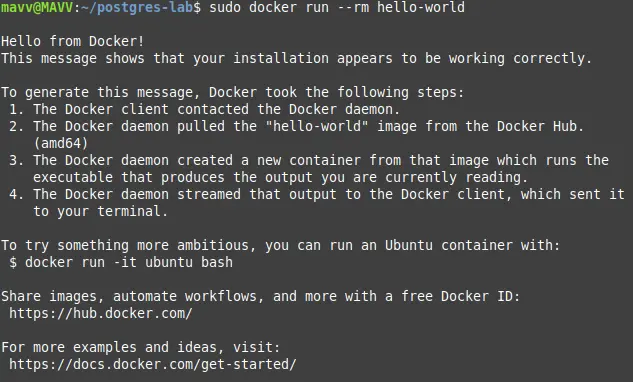  
**Figura 3. Verificación Hello from Docker!**

### 2.3 El archivo `Dockerfile`

#### 2.3.1 ¿Qué es?

Un **`Dockerfile`** es un archivo de texto plano, sin extensión, que contiene la **receta para construir una imagen**. Cada línea es una instrucción que genera una capa nueva sobre la anterior. Se lee de arriba abajo y el mismo `Dockerfile` produce la misma imagen en cualquier equipo.

> ### DATO...
> Para PostgreSQL **no siempre es necesario escribir un `Dockerfile`**, ya que, la imagen oficial `postgres` ya está construida y lista. Se crea un `Dockerfile` propio solo cuando se quiere *personalizar* esa imagen base: agregar extensiones, cambiar la zona horaria o incluir un guion SQL de inicialización. Caso que documente a continuación.

#### 2.3.2 Propuesta para la estructura de carpetas del proyecto

```
proyecto-postgres/
├── Dockerfile
├── docker-compose.yml
├── .env
└── init/
    └── 01-esquema.sql
```

Comandos para crearla:

```bash
mkdir -p ~/proyecto-postgres/init
cd ~/proyecto-postgres
touch Dockerfile docker-compose.yml .env
touch init/01-esquema.sql
```

| Elemento | Significado |
|---|---|
| `mkdir` | *Make directory*: Crea directorios. |
| `-p` | *Parents*: Crea los directorios padre que hagan falta y no marca error si ya existen. |
| `~` | Atajo de la terminal para la carpeta personal del usuario (`/home/tu_usuario`). |
| `cd` | *Change directory*: Entra a la carpeta indicada. |
|`touch`|Comando nativo de Linux que sirve para crear archivos nuevos y completamente vacíos sin necesidad de abrir un editor de texto.|
|`.env`|Para el tercer archivo, el punto al inicio de su nombre es una regla de Linux para hacer que el archivo sea oculto. Es una práctica de seguridad estándar para que las contraseñas no queden expuestas a simple vista.|

#### 2.3.3 Contenido del `Dockerfile`

```dockerfile
# Imagen base: distribución oficial de PostgreSQL 17 sobre Debian "bookworm" en versión reducida.
FROM postgres:17-bookworm

# Metadatos informativos de la imagen.
LABEL maintainer="usario@ejemplo.com"
LABEL description="PostgreSQL 17 personalizado para la tarea de SGBD"

# Configuración regional: define el idioma y la zona horaria del contenedor.
ENV LANG=en_US.utf8
ENV TZ=America/Monterrey

# Copia los guiones de inicialización dentro de la imagen.
COPY ./init/ /docker-entrypoint-initdb.d/

# Documenta que el servicio escucha en el puerto 5432.
EXPOSE 5432
```
**NOTA:** El idioma o formato regional como español de México o España no tiene preinstalado por defecto en la imagen oficial de postgres:17. Al no encontrar ese idioma, se bloquea y cancela el arranque.

| Instrucción | Qué hace exactamente |
|---|---|
| `#` | Comentario: Docker ignora la línea; sirve para documentar. |
| `FROM postgres:17-bookworm` | Define la **imagen base** sobre la que se construirá. Debe ser siempre la primera instrucción. `postgres` es el nombre de la imagen y `17-bookworm` es la **etiqueta** (*tag*): PostgreSQL 17 sobre Debian 12 "bookworm". Fijar una etiqueta concreta en lugar de `latest` garantiza que el proyecto no se rompa cuando salga una versión nueva. |
| `LABEL clave="valor"` | Añade metadatos a la imagen, consultables con `docker inspect`. No afecta la ejecución. |
| `ENV LANG=es_MX.utf8` | Define una **variable de entorno**: un valor con nombre que existe dentro del contenedor y que los programas pueden leer. Aquí fija el idioma y la codificación de caracteres (UTF-8 permite acentos y la ñ). |
| `ENV TZ=America/Monterrey` | Establece la zona horaria, para que las marcas de tiempo de los registros y de las columnas `timestamp` correspondan a la hora local. |
| `COPY ./init/ /docker-entrypoint-initdb.d/` | Copia archivos **desde la máquina anfitriona hacia la imagen**. El origen (`./init/`) es relativo a la carpeta del `Dockerfile`; el destino es una ruta dentro del contenedor. Esa carpeta destino es especial: la imagen oficial de PostgreSQL ejecuta automáticamente todo archivo `.sql` o `.sh` que encuentre ahí, **pero solo la primera vez, cuando el clúster de datos está vacío**. |
| `EXPOSE 5432` | **Es solo documentación.** Declara qué puerto usa la aplicación, pero **no abre nada** hacia el exterior. La apertura real se hace con el mapeo de puertos de la sección 2.4. |

Contenido para el ejemplo de `init/01-esquema.sql`:

```sql
CREATE TABLE IF NOT EXISTS alumnos (
    id          SERIAL PRIMARY KEY,
    matricula   VARCHAR(15) UNIQUE NOT NULL,
    nombre      VARCHAR(100) NOT NULL,
    carrera     VARCHAR(80),
    inscrito_en TIMESTAMP DEFAULT CURRENT_TIMESTAMP
);

INSERT INTO alumnos (matricula, nombre, carrera) VALUES
    ('A00123456', 'MAVV',  'Ingeniería en Sistemas'),
    ('A00123457', 'Snoopy', 'Ingeniería en Software');
```

### 2.4 El archivo `docker-compose.yml`

#### 2.4.1 ¿Qué es y qué es la orquestación?

Un contenedor aislado se puede levantar con un `docker run` larguísimo, lleno de banderas. El problema aparece cuando una aplicación real necesita **varios contenedores** coordinados: la base de datos, el cliente web de administración, quizá un servidor de aplicaciones. Coordinarlos a mano es frágil y difícil de repetir.

La **orquestación** es precisamente eso: administrar de forma automatizada el ciclo de vida de un conjunto de contenedores, en qué orden arrancan, cómo se comunican entre sí, qué red comparten, qué hacer si uno se cae.

**Docker Compose** es la herramienta de orquestación para un solo equipo. El archivo `docker-compose.yml` es **declarativo**: en lugar de describir los pasos a seguir, se describe el **estado final deseado** y Compose se encarga de alcanzarlo.

> ### DATO...
> **YAML** (*YAML Ain't Markup Language*) es el formato de estos archivos. Su regla más importante es que **la jerarquía se expresa con sangría de espacios**, y **está prohibido usar el tabulador**. Un solo espacio de más o de menos provoca un error de sintaxis. Para orquestar contenedores repartidos en decenas de servidores se usa una herramienta mayor: **Kubernetes**.

#### 2.4.2 Archivo de variables `.env`

Nunca deben escribirse contraseñas dentro del `docker-compose.yml`, porque ese archivo se sube a repositorios como GitHub. Se separan en un archivo `.env`:

```bash
POSTGRES_USER=admin_ejemplo
POSTGRES_PASSWORD=Sup3rS3cr3ta_2026
POSTGRES_DB=ejemplo_db
PUERTO_HOST=5432
```

Docker Compose lee automáticamente el archivo `.env` de la misma carpeta y sustituye cada `${VARIABLE}`. El archivo `.env` debe listarse en `.gitignore`.

#### 2.4.3 Contenido del `docker-compose.yml`

```yaml
services:

  base_datos:
    build:
      context: .
      dockerfile: Dockerfile
    image: postgres-ejemplo:1.0
    container_name: pg_ejemplo
    restart: unless-stopped
    environment:
      POSTGRES_USER: ${POSTGRES_USER}
      POSTGRES_PASSWORD: ${POSTGRES_PASSWORD}
      POSTGRES_DB: ${POSTGRES_DB}
      PGDATA: /var/lib/postgresql/data/pgdata
    ports:
      - "${PUERTO_HOST}:5432"
    volumes:
      - datos_pg:/var/lib/postgresql/data
    networks:
      - red_ejemplo
    healthcheck:
      test: ["CMD-SHELL", "pg_isready -U ${POSTGRES_USER} -d ${POSTGRES_DB}"]
      interval: 10s
      timeout: 5s
      retries: 5

  adminer:
    image: adminer:latest
    container_name: adminer_ejemplo
    restart: unless-stopped
    depends_on:
      base_datos:
        condition: service_healthy
    ports:
      - "8080:8080"
    networks:
      - red_ejemplo

volumes:
  datos_pg:
    name: volumen_datos_ejemplo

networks:
  red_ejemplo:
    driver: bridge
```

#### 2.4.4 Explicación línea por línea

**`services:`** — Bloque principal. Cada entrada bajo él define un contenedor. Aquí hay dos: `base_datos` y `adminer`.

**`base_datos:`** — Nombre lógico del servicio. **Funciona además como nombre de host dentro de la red interna**: el contenedor de Adminer podrá contactar a la base de datos escribiendo simplemente `base_datos` como servidor, sin conocer su dirección IP.

**`build:`** — Indica que la imagen debe **construirse** localmente en lugar de descargarse.
  - `context: .` — El **contexto de construcción**: la carpeta cuyo contenido se envía al motor de Docker para construir. El punto significa "la carpeta actual". Las rutas del `COPY` del `Dockerfile` se resuelven a partir de aquí.
  - `dockerfile: Dockerfile` — Nombre del archivo de receta a usar.

**`image: postgres-ejemplo:1.0`** — Nombre y versión que se le dará a la imagen resultante. (Si se omitiera `build:`, esta línea indicaría en cambio qué imagen *descargar* de Docker Hub.)

**`container_name: pg_ejemplo`** — Nombre fijo y legible del contenedor. Sin esta línea, Docker generaría uno automático como `proyecto-postgres-base_datos-1`.

**`restart: unless-stopped`** — **Política de reinicio.** Si el contenedor se cae por un error, o si se reinicia la computadora, Docker lo vuelve a levantar solo; la única excepción es que el usuario lo haya detenido a propósito. Otros valores posibles: `no`, `always`, `on-failure`.

**`environment:`** — Variables de entorno que se inyectan al contenedor en el momento de arrancar. La imagen oficial de PostgreSQL las interpreta así:
  - `POSTGRES_USER` — Nombre del **superusuario** que se creará. Si se omite, se usa `postgres`.
  - `POSTGRES_PASSWORD` — Su contraseña. **Es la única variable obligatoria**; sin ella el contenedor se niega a arrancar por seguridad.
  - `POSTGRES_DB` — Nombre de la base de datos que se creará vacía al inicio.
  - `PGDATA` — Ruta interna donde vivirán los archivos del clúster. Se coloca en un **subdirectorio** (`/data/pgdata` en lugar de `/data`) porque así el punto de montaje del volumen queda limpio, práctica recomendada por la propia documentación de la imagen.
  - `${VARIABLE}` — Sustitución del valor tomado del archivo `.env`.

**`ports:`** — El **mapeo de puertos**. Esta es la línea que conecta el mundo aislado del contenedor con la computadora.
  - Formato: `"PUERTO_DEL_ANFITRIÓN:PUERTO_DEL_CONTENEDOR"`.
  - `"5432:5432"` significa: *toda conexión que llegue al puerto 5432 de Linux Mint, redirígela al puerto 5432 dentro del contenedor.*
  - El de la **izquierda** es el que se escribe en DBeaver y **se puede cambiar libremente**, el de la derecha está fijado por PostgreSQL.
  - **Advertencia:** Si ya existe una instalación nativa de PostgreSQL ocupando el 5432 (sección 3), este contenedor fallará con `port is already allocated`. La solución es poner `PUERTO_HOST=5433` en el archivo `.env`, con lo que el mapeo queda `"5433:5432"`.

> ### DATO...
> El **mapeo** (*port mapping* o publicación de puertos) es una traducción de direcciones de red: el demonio de Docker inserta reglas en el cortafuegos del kernel (`iptables`/`nftables`) para reenviar el tráfico. Si se omite el bloque `ports:`, el contenedor sigue funcionando y sus compañeros de red pueden verlo, pero es **invisible desde fuera**: no habría forma de conectarse con DBeaver.

**`volumes:`** — El **almacenamiento persistente**.
  - `datos_pg:/var/lib/postgresql/data` monta el volumen llamado `datos_pg` sobre la carpeta de datos interna de PostgreSQL.
  - **Por qué es indispensable:** el sistema de archivos de un contenedor es *efímero*. Al eliminar el contenedor, todo lo escrito dentro desaparece. Un **volumen** es un área de almacenamiento gestionada por Docker que vive **fuera** del ciclo de vida del contenedor (en `/var/lib/docker/volumes/`). Sin esta línea, borrar el contenedor equivaldría a perder toda la base de datos.
  - Existen dos modalidades: el **volumen nombrado** (el usado aquí, Docker gestiona la ubicación y los permisos, es la opción recomendada para bases de datos) y el **bind mount** (se monta una carpeta concreta del anfitrión, por ejemplo `./datos:/var/lib/postgresql/data`, es más visible pero suele dar problemas de permisos y de rendimiento).

**`networks:`** — Adscribe el contenedor a una **red virtual** definida al final del archivo.

**`healthcheck:`** — **Comprobación de salud.** Docker ejecuta periódicamente un comando dentro del contenedor para decidir si el servicio está realmente listo, no solo **encendido**.
  - `test: ["CMD-SHELL", "pg_isready -U usuario -d base"]` — `pg_isready` es una utilidad de PostgreSQL que responde si el servidor acepta conexiones. `-U` indica el usuario y `-d` la base de datos.
  - `interval: 10s` — Frecuencia de la comprobación.
  - `timeout: 5s` — Tiempo máximo de espera antes de dar la prueba por fallida.
  - `retries: 5` — Fallos consecutivos necesarios para marcar el contenedor como `unhealthy`.

**`adminer:`** — Segundo servicio: un cliente web ligero de administración de bases de datos.
  - `depends_on: base_datos: condition: service_healthy` — **Orden de arranque.** Adminer no se levantará hasta que el `healthcheck` de la base de datos reporte éxito. Sin la condición `service_healthy`, Docker solo esperaría a que el contenedor *arranque*, no a que PostgreSQL esté listo para aceptar consultas.
  - `ports: "8080:8080"` — Publica la interfaz web en `http://localhost:8080`.

**`volumes:` (bloque final, sin sangría)** — Declara formalmente los volúmenes nombrados que usan los servicios. `name: volumen_datos_ejemplo` fija un nombre fijo en lugar del generado automáticamente.

**`networks:` (bloque final)** — Declara la red. `driver: bridge` es el controlador por defecto: crea una red privada virtual donde los contenedores se ven entre sí por su nombre de servicio y quedan aislados del resto del sistema.

### 2.5 Levantar el contenedor en segundo plano

```bash
docker compose up -d
```

| Elemento | Significado |
|---|---|
| `docker` | La interfaz de línea de comandos. |
| `compose` | Subcomando que activa el orquestador; lee el `docker-compose.yml` de la carpeta actual. |
| `up` | Acción: construir imágenes si hace falta, crear redes, crear volúmenes, crear contenedores y arrancarlos. Es **idempotente**: si algo ya existe y está correcto, no lo recrea. |
| `-d` | **`--detach` (desacoplado).** Esta es la bandera clave. Sin ella, los contenedores quedan "enganchados" a la terminal: los registros se imprimen en pantalla y **si se cierra la terminal o se pulsa Ctrl+C, los contenedores se detienen**. Con `-d`, Docker los envía a **segundo plano** como servicios independientes, devuelve el control de la terminal inmediatamente y los contenedores siguen corriendo aunque se cierre la ventana. |

Otras banderas útiles:

| Bandera | Uso |
|---|---|
| `--build` | Fuerza la reconstrucción de la imagen aunque ya exista (necesaria tras editar el `Dockerfile`). |
| `-f otro-archivo.yml` | Usa un archivo de composición con otro nombre o ubicación. |
| `--force-recreate` | Recrea los contenedores aunque su configuración no haya cambiado. |

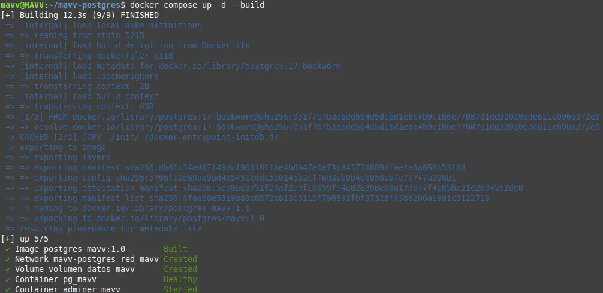  
**Figura 4. Contenedor levantado.**

### 2.6 Verificación del estado del contenedor

#### a) Listar contenedores del proyecto

```bash
docker compose ps
```

Muestra una tabla con el nombre, la imagen, el estado (`Up 2 minutes (healthy)`) y el mapeo de puertos (`0.0.0.0:5432->5432/tcp`). La palabra **`healthy`** confirma que el `healthcheck` está pasando.

Variante para ver **todos** los contenedores del sistema, incluidos los detenidos:

```bash
docker ps -a
```

- `ps` — *process status*: Por analogía con el comando de Unix que lista procesos.
- `-a` — *all*: Sin esta bandera solo se listan los contenedores en ejecución.

#### b) Leer los registros

```bash
docker compose logs -f base_datos
```

| Elemento | Significado |
|---|---|
| `logs` | Muestra la salida estándar del contenedor: el diario de arranque de PostgreSQL. |
| `-f` | *follow*: Deja la terminal "escuchando" y va imprimiendo las líneas nuevas en tiempo real. Se sale con **Ctrl+C** (esto no detiene el contenedor). |
| `base_datos` | Limita la salida a ese servicio, si se omite, se mezclan los registros de todos. |

La línea que confirma el éxito es: `database system is ready to accept connections`.

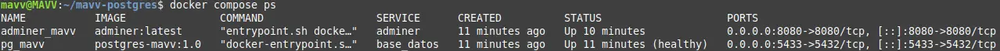  
**Figura 5. Verificación del estado del contenedor.**

#### c) Entrar al contenedor y consultar desde `psql`

```bash
docker exec -it pg_ejemplo psql -U admin_ejemplo -d ejemplo_db
```

| Elemento | Significado |
|---|---|
| `exec` | Ejecuta un comando **dentro de un contenedor que ya está corriendo** (a diferencia de `run`, que crea uno nuevo). |
| `-i` | *Interactive*: Mantiene abierta la entrada estándar, para poder escribir. |
| `-t` | *tty*: Asigna una terminal virtual, lo que da el símbolo del sistema y el formato correcto. Juntas, `-it` producen una sesión interactiva usable. |
| `pg_ejemplo` | El `container_name` definido en el YAML. |
| `psql` | El cliente oficial de PostgreSQL en línea de comandos, ya incluido en la imagen. |
| `-U admin_ejemplo` | *User*: usuario con el que se inicia sesión. |
| `-d ejemplo_db` | *Database*: base de datos a la que se conecta. |

Dentro de `psql` se pueden usar las **metaórdenes**, que empiezan con barra invertida:

| Orden | Función |
|---|---|
| `\l` | Lista todas las bases de datos del clúster. |
| `\dt` | *Describe tables*: lista las tablas del esquema actual. |
| `\d alumnos` | Describe la estructura de la tabla `alumnos`. |
| `\du` | Lista los usuarios (roles) y sus atributos. |
| `\conninfo` | Muestra los datos de la conexión actual. |
| `\q` | *Quit*: sale de `psql`. |

Consulta de comprobación:

```sql
SELECT version();
SELECT * FROM alumnos;
```

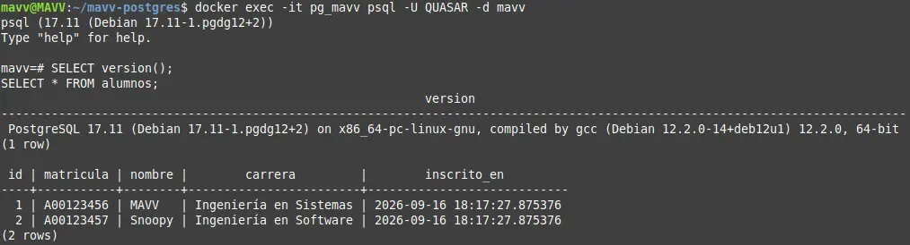  
**Figura 6. Entrada al contenedor y consulta.**

#### d) Comandos de administración del ciclo de vida

| Comando | Efecto |
|---|---|
| `docker compose stop` | Detiene los contenedores sin eliminarlos; los datos y la configuración permanecen. |
| `docker compose start` | Vuelve a arrancar contenedores detenidos. |
| `docker compose restart` | Detiene y arranca en un solo paso. |
| `docker compose down` | Detiene **y elimina** contenedores y redes. **El volumen sobrevive**, por lo que los datos no se pierden. |
| `docker compose down -v` | Igual que el anterior, pero la bandera `-v` (*volumes*) **borra también los volúmenes**. Deja el sistema exactamente como estaba antes de empezar. **Es una operación destructiva e irreversible.** |
| `docker volume ls` | Lista los volúmenes existentes, para comprobar que `volumen_datos_ejemplo` sigue ahí. |

> ### DATO...
> La misma letra puede significar cosas distintas según el comando: en `docker compose down -v` la `-v` significa *volumes* (borrar volúmenes), mientras que en `docker run -v /origen:/destino` significa *volume* (montar un volumen), y en muchos otros programas de Unix significa *verbose* (salida detallada). Por eso siempre conviene consultar `docker compose down --help`.

## 3. Método 2: Instalación tradicional (nativa) con APT

### 3.1 Consideración previa: El conflicto de puertos

Si el contenedor de la sección 2 sigue en ejecución y publicado en el puerto 5432, la instalación nativa intentará usar ese mismo puerto. APT instalará el paquete sin error, pero el servicio podría no arrancar, o bien PostgreSQL se autoasignará el puerto 5433. Para la instalacion recomiendo detener antes el contenedor:

```bash
docker compose stop
```

### 3.2 Paso 1: Actualizar el catálogo de paquetes

```bash
sudo apt update
```

Como ya se explicó, este comando **no instala ni actualiza nada**, únicamente descarga de los repositorios las listas con los paquetes disponibles y sus versiones, y las compara con las que ya tiene el sistema. Al final informa cuántos paquetes pueden actualizarse.

Opcionalmente, para actualizar el sistema completo antes de instalar:

```bash
sudo apt upgrade -y
```

- `upgrade` — Descarga e instala las versiones nuevas de los paquetes ya instalados, **sin eliminar** ninguno.
- La variante `full-upgrade` sí permite eliminar paquetes si es necesario para resolver dependencias.

### 3.3 Paso 2: Consultar la versión disponible (opcional pero lo recomiendo)

```bash
apt policy postgresql
apt search postgresql | head -n 20
```

| Elemento | Significado |
|---|---|
| `apt policy <paquete>` | Muestra qué versión está instalada, cuál es la candidata a instalarse y de qué repositorio proviene. |
| `apt search <texto>` | Busca el texto en los nombres y descripciones de los paquetes. |
| `head -n 20` | Recorta la salida a las primeras 20 líneas, para que no inunde la terminal. |

Los repositorios de Linux Mint incluyen la versión de PostgreSQL que venía con la base de Ubuntu correspondiente. Si se requiere una versión más reciente, existe el repositorio oficial **PGDG** (*PostgreSQL Global Development Group*) en `apt.postgresql.org`.

### 3.4 Paso 3: Instalar PostgreSQL

```bash
sudo apt install -y postgresql postgresql-contrib
```

| Paquete | Contenido |
|---|---|
| `postgresql` | Metapaquete que arrastra el servidor (`postgresql-XX`), el cliente (`postgresql-client-XX`) y los archivos comunes. |
| `postgresql-contrib` | Colección de módulos adicionales mantenidos por el proyecto: `pgcrypto` (cifrado), `uuid-ossp` (identificadores únicos), `pg_stat_statements` (estadísticas de consultas), entre otros. No se instalan solos; se activan con `CREATE EXTENSION`. |

Lo que sucede automáticamente durante la instalación:

1. Se crea el usuario del sistema **`postgres`**, dueño de los archivos de la base de datos.
2. Se inicializa un clúster llamado `main` en `/var/lib/postgresql/<versión>/main/`.
3. Se generan los archivos de configuración en `/etc/postgresql/<versión>/main/`.
4. Se registra el servicio en **systemd** y se arranca de inmediato.

> ### DATO...
> **systemd** es el proceso de inicio de Linux Mint, es el primer programa que arranca el kernel (PID 1) y el responsable de lanzar y supervisar todos los servicios. Cada servicio se describe en un archivo llamado **unidad** (*unit*). La herramienta para hablar con él es **`systemctl`**.

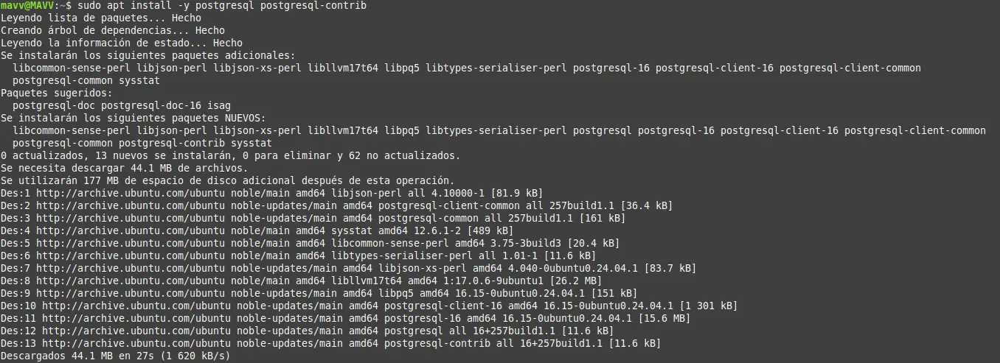  
**Figura 7. Instalacion de PostgreSQL.**

### 3.5 Paso 4: Verificar que el servicio está activo

```bash
systemctl status postgresql
```

| Elemento | Significado |
|---|---|
| `systemctl` | Herramienta de control de systemd. |
| `status` | Muestra el estado actual de la unidad, sus últimas líneas de registro y si está habilitada para el arranque. |
| `postgresql` | Nombre de la unidad. |

En la salida deben buscarse dos datos:

- **`Loaded: ... enabled`** — la palabra `enabled` significa que el servicio arrancará solo al encender la computadora.
- **`Active: active (exited)`** — puede sorprender, pero es **correcto**. La unidad `postgresql` es solo un *envoltorio* que agrupa a los clústeres, termina su trabajo y sale. El servicio real es la unidad instanciada.

Para ver el proceso verdadero:

```bash
systemctl status postgresql@17-main
```

(Sustituyendo `17` por la versión que se haya instalado.) Aquí debe leerse **`Active: active (running)`**.

Comandos complementarios de verificación:

```bash
pg_isready
pg_lsclusters
sudo ss -tulpn | grep 5432
```

| Comando | Qué comprueba |
|---|---|
| `pg_isready` | Pregunta al servidor si acepta conexiones. Responde `/var/run/postgresql:5432 - accepting connections`. |
| `pg_lsclusters` | Propio de Debian/Ubuntu/Mint: lista los clústeres instalados con su versión, puerto, estado y rutas. |
| `ss -tulpn` | *Socket statistics*: `-t` TCP, `-u` UDP, `-l` solo puertos a la escucha (*listening*), `-p` el proceso dueño, `-n` muestra números de puerto en vez de nombres. Combinado con `grep 5432` filtra la línea de PostgreSQL y confirma quién ocupa el puerto. |

Control manual del servicio:

| Comando | Efecto |
|---|---|
| `sudo systemctl start postgresql` | Arranca el servicio. |
| `sudo systemctl stop postgresql` | Lo detiene. |
| `sudo systemctl restart postgresql` | Lo reinicia (aplica cambios de configuración que exigen reinicio). |
| `sudo systemctl reload postgresql` | Recarga la configuración sin cortar las conexiones activas. |
| `sudo systemctl enable postgresql` | Lo habilita para el arranque automático. |
| `sudo systemctl disable postgresql` | Lo deshabilita. |

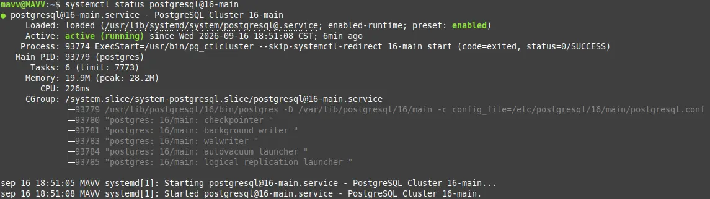  
**Figura 8. Verificación del servicio.**

### 3.6 Paso 5: Establecer la contraseña del superusuario

Recién instalado, el usuario `postgres` **no tiene contraseña**, el acceso se hace mediante autenticación *peer*.

> ### DATO...
> La autenticación **`peer`** consiste en que PostgreSQL le pregunta al sistema operativo qué usuario de Linux está ejecutando el cliente, y lo acepta si su nombre coincide con el del rol solicitado. Funciona únicamente en conexiones locales por *socket* de Unix. Es la razón por la que `sudo -u postgres psql` entra sin pedir contraseña, mientras que un cliente gráfico conectándose por TCP/IP sí la necesita.

```bash
sudo -u postgres psql
```

- `-u postgres` — Bandera de `sudo` que indica **con qué usuario** ejecutar el comando. Sin ella, `sudo` usaría `root`, y PostgreSQL rechazaría la conexión porque no existe un rol llamado `root`.

Ya dentro de `psql`, se ejecutan las sentencias SQL:

```sql
ALTER USER postgres WITH PASSWORD 'EjemploContrasena';

CREATE DATABASE bd_nativa_ejemplo;

CREATE USER admin_ejemplo WITH PASSWORD 'OtraContraseña';
GRANT ALL PRIVILEGES ON DATABASE bd_nativa_ejemplo TO admin_ejemplo;

\q
```

| Sentencia | Función |
|---|---|
| `ALTER USER ... WITH PASSWORD` | Asigna o cambia la contraseña de un rol existente. |
| `CREATE DATABASE` | Crea una base de datos nueva y vacía dentro del clúster. |
| `CREATE USER` | Crea un rol con permiso de inicio de sesión. |
| `GRANT ALL PRIVILEGES ON DATABASE ... TO ...` | Otorga a ese rol todos los permisos sobre la base indicada. |

> ### DATO...
> En PostgreSQL moderno, `USER` y `GROUP` son en realidad la misma entidad, un **rol** (`ROLE`). Un rol con el atributo `LOGIN` es lo que se conoce como usuario, sin él, funciona como grupo de permisos.

### 3.7 Paso 6: Permitir conexiones con contraseña

Para que un cliente gráfico pueda entrar, deben revisarse dos archivos.

**a) `postgresql.conf`** — Configuración general del servidor:

```bash
sudo nano /etc/postgresql/17/main/postgresql.conf
```

Parámetros de interés:

| Parámetro | Significado |
|---|---|
| `listen_addresses = 'localhost'` | Direcciones de red en las que el servidor escucha. `localhost` (valor por defecto) basta para conectarse desde el mismo equipo. Cambiarlo a `'*'` lo abriría a toda la red, lo que **no es recomendado** en un entorno de producción real. |
| `port = 5432` | Puerto de escucha. |
| `max_connections = 100` | Número máximo de conexiones simultáneas. |

**b) `pg_hba.conf`** — Reglas de autenticación (*Host-Based Authentication*):

```bash
sudo nano /etc/postgresql/17/main/pg_hba.conf
```

Sus columnas son: `TIPO  BASE  USUARIO  DIRECCIÓN  MÉTODO`. Una línea típica y correcta para este caso:

```
host    all    all    127.0.0.1/32    scram-sha-256
```

| Columna | Significado |
|---|---|
| `host` | Conexión por red TCP/IP (frente a `local`, que es por socket de Unix). |
| `all all` | Aplica a todas las bases de datos y a todos los usuarios. |
| `127.0.0.1/32` | Solo desde la propia máquina (dirección de bucle local). |
| `scram-sha-256` | Método de autenticación por contraseña con cifrado moderno; sustituye al obsoleto `md5`. |

Tras editar, aplicar los cambios:

```bash
sudo systemctl restart postgresql
```

- `nano` — Editor de texto en terminal. Se guarda con **Ctrl+O** y **Enter**, y se sale con **Ctrl+X**.

## 4. Prueba de fuego: Conexión mediante cliente gráfico

### 4.1 ¿Qué es un cliente gráfico?

Un **cliente** es cualquier programa que se conecta a un servidor para solicitarle un servicio. Un **cliente gráfico** (o **cliente GUI**, *Graphical User Interface*) es aquel que ofrece una interfaz con ventanas, menús, botones y tablas, en lugar de una línea de comandos.

En bases de datos, un cliente gráfico permite:

- Conectarse a uno o varios servidores y guardar los perfiles de conexión.
- Navegar visualmente por el árbol de bases de datos, esquemas, tablas, vistas, índices y funciones.
- Escribir y ejecutar consultas SQL con coloreado de sintaxis y autocompletado.
- Ver y editar los resultados como una hoja de cálculo.
- Diseñar diagramas entidad-relación, exportar datos e importar archivos CSV.

> ### DATO...
> El cliente gráfico **no contiene la base de datos**, es solo una ventana hacia ella. Toda consulta que se escribe viaja por el puerto 5432 hasta el servidor PostgreSQL, se procesa allí y solo el resultado regresa. Por eso una misma base puede consultarse indistintamente con `psql`, con DBeaver o desde un programa en Python, **el protocolo de comunicación es el mismo**.

Los clientes gráficos más comunes para PostgreSQL son:

| Cliente | Tipo | Característica |
|---|---|---|
| **DBeaver Community** | Aplicación de escritorio (Java) | Universal: soporta PostgreSQL, MySQL, SQLite, Oracle, etc. Gratuito. |
| **pgAdmin 4** | Web o escritorio | Cliente oficial del proyecto PostgreSQL. |
| **Adminer** | Web, un solo archivo PHP | Extremadamente ligero, ideal como contenedor auxiliar. |
| **DataGrip** | Escritorio | De JetBrains, comercial. |

### 4.2 Opción A: Adminer

Como el archivo de composición de la sección 2 ya levanta un contenedor de Adminer, no hay nada que instalar.

1. Abrir el navegador en **`http://localhost:8080`**.
2. Llenar el formulario de acceso:

| Campo | Valor | Explicación |
|---|---|---|
| Motor / *System* | `PostgreSQL` | Selecciona el controlador adecuado. |
| Servidor / *Server* | `base_datos` | **Se usa el nombre del servicio, no `localhost`.** Adminer corre *dentro* de la red de Docker, donde `localhost` sería el propio contenedor de Adminer. Docker resuelve `base_datos` a la IP interna del contenedor de PostgreSQL. |
| Usuario | `admin_ejemplo` | El definido en `POSTGRES_USER`. |
| Contraseña | La de `POSTGRES_PASSWORD` | |
| Base de datos | `ejemplo_db` | La definida en `POSTGRES_DB`. |

3. Pulsar *Entrar*. Debe aparecer el listado de tablas, incluida `alumnos`.

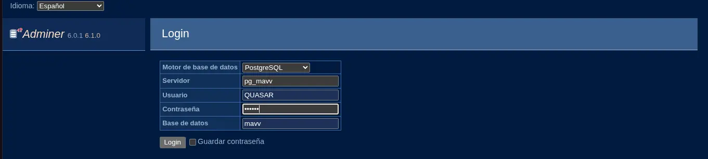  
**Figura 9. Formulario de inicio de sesión.**

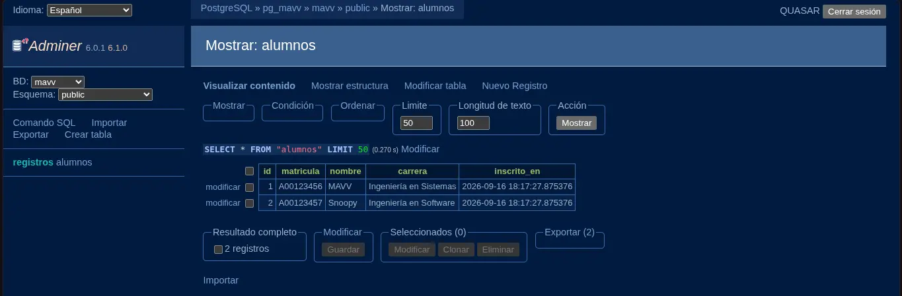  
**Figura 10. Vista de la tabla alumnos.**

### 4.3 Opción B: DBeaver Community

#### Paso 1: Instalación en Linux Mint

**Vía gestor de programas:** abrir *Menú → Administración → Gestor de programas*, buscar "DBeaver" e instalar.

**Vía terminal con Flatpak:**

```bash
flatpak install flathub io.dbeaver.DBeaverCommunity
```

**Vía paquete `.deb` oficial:** descargar el archivo desde el sitio de DBeaver y ejecutar:

```bash
sudo apt install -y ./dbeaver-ce_latest_amd64.deb
```

- El prefijo `./` es obligatorio: le indica a APT que se trata de un **archivo local** y no del nombre de un paquete de los repositorios. APT resolverá además sus dependencias (incluido Java).

#### Paso 2: Crear la conexión

1. Abrir DBeaver. Ir a **Base de datos → Nueva conexión** (el icono del enchufe con el signo `+`).
2. Elegir **PostgreSQL** de la lista y pulsar *Siguiente*.
3. La primera vez, DBeaver ofrecerá **descargar el controlador JDBC**. Se debe aceptar.

> ### DATO...
> Un **controlador** (*driver*) **JDBC** (*Java Database Connectivity*) es la biblioteca que traduce las instrucciones de un programa Java al protocolo binario propio de PostgreSQL. Cada motor de base de datos tiene el suyo; por eso DBeaver puede hablar con tantos sistemas distintos.

#### Paso 3: Llenar los parámetros de conexión

| Campo | Método Docker | Método nativo |
|---|---|---|
| **Host** | `localhost` | `localhost` |
| **Puerto** | `5432` (o `5433` si se cambió por conflicto) | `5432` |
| **Base de datos** | `ejemplo_db` | `ejemplo_nativa` |
| **Usuario** | `admin_ejemplo` | `admin_ejemplo` o `postgres` |
| **Contraseña** | La del archivo `.env` | La fijada con `ALTER USER` |

Nota importante: aquí **sí** se escribe `localhost`, a diferencia de Adminer. DBeaver se ejecuta en Linux Mint (fuera de Docker), así que llega al contenedor a través del **mapeo de puertos** definido en `ports:`. Este es un ejemplo de para qué sirve el mapeo.

Conviene marcar la casilla **"Guardar contraseña"** para no tener que reescribirla.

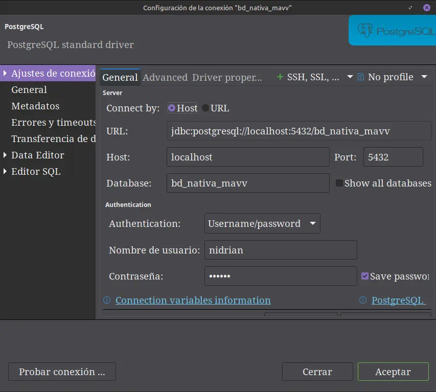  
**Figura 11. Configuracion de conexión.**

#### Paso 4: Probar la conexión

Pulsar el botón **"Probar conexión" (*Test Connection*)**, abajo a la izquierda.

- **Resultado esperado:** Una ventana con `Conectado`, el nombre y la versión del servidor y los datos del controlador.
- **Si falla**, consultar la tabla de diagnóstico de la sección 4.4.

Pulsar *Finalizar* para guardar la conexión.

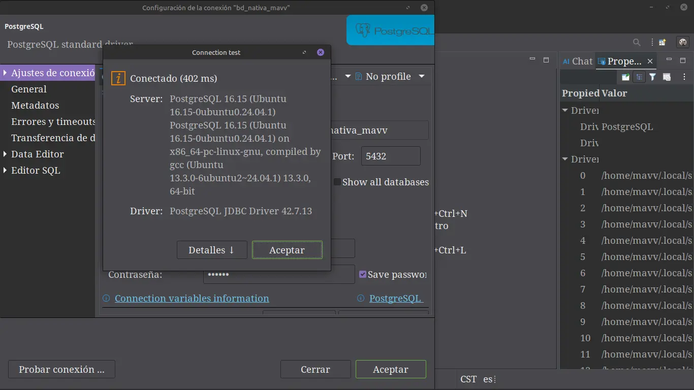  
**Figura 12. Test de conexión.**

#### Paso 5: Ejecutar una consulta de verificación

Con la conexión seleccionada, abrir un editor SQL con **Ctrl + ]** o desde *SQL Editor → Nuevo script SQL*, y ejecutar con **Ctrl + Enter**:

```sql
-- Verificar la versión del servidor
SELECT version();

-- Verificar a qué base y con qué usuario estamos conectados
SELECT current_database(), current_user, inet_server_port();

-- Crear una tabla de prueba
CREATE TABLE IF NOT EXISTS prueba_conexion (
    id          SERIAL PRIMARY KEY,
    descripcion TEXT NOT NULL,
    registrado  TIMESTAMP DEFAULT NOW()
);

-- Insertar un registro
INSERT INTO prueba_conexion (descripcion)
VALUES ('Conexión verificada correctamente desde el cliente gráfico');

-- Consultar el resultado
SELECT * FROM prueba_conexion;
```

| Función SQL | Qué devuelve |
|---|---|
| `version()` | Cadena con la versión exacta de PostgreSQL y del compilador. |
| `current_database()` | Nombre de la base de datos activa. |
| `current_user` | Rol con el que se está autenticado. |
| `inet_server_port()` | Puerto real por el que entró la conexión: útil para comprobar si se está hablando con el contenedor (5433) o con la instalación nativa (5432). |
| `SERIAL` | Tipo de dato entero autoincremental: genera el `id` automáticamente. |
| `NOW()` | Marca de tiempo del momento de la inserción. |

La aparición de la fila en la cuadrícula de resultados es la **prueba definitiva** de que el servidor está instalado, activo, accesible por red y aceptando escrituras.

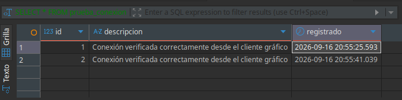  
**Figura 13. Consulta de verificación.**

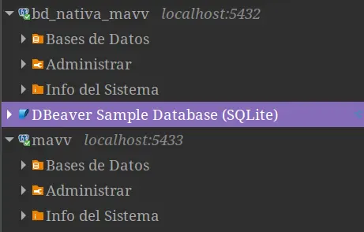  
**Figura 14. Conexión simultanea de ambos métodos.**

### 4.4 Solución de problemas frecuentes

| Mensaje de error | Causa probable | Solución |
|---|---|---|
| `Connection refused` | El servidor no está corriendo o el puerto es incorrecto. | `docker compose ps` o `systemctl status postgresql@17-main`; verificar el puerto con `ss -tulpn \| grep 5432`. |
| `password authentication failed for user` | Contraseña incorrecta o mal copiada del `.env`. | Verificar el archivo `.env`; en la instalación nativa, repetir `ALTER USER`. |
| `FATAL: no pg_hba.conf entry for host` | El archivo de autenticación no permite esa conexión. | Añadir la línea `host all all 127.0.0.1/32 scram-sha-256` y reiniciar el servicio. |
| `port is already allocated` | Otro proceso (normalmente el PostgreSQL nativo) ocupa el 5432. | Cambiar `PUERTO_HOST` a `5433` en `.env`, o detener el servicio nativo. |
| `database "..." does not exist` | El nombre de la base está mal escrito. | Verificar con `\l` dentro de `psql`. |
| Los cambios del `init/*.sql` no aparecen | Los guiones de inicialización solo corren con el volumen vacío. | `docker compose down -v` y volver a levantar (**borra los datos**). |

## 5. Conclusiones

### 5.1 Resultados obtenidos

Pude lograr poner en operación PostgreSQL en Linux Mint Cinnamon por dos vías independientes. La vía nativa con APT resultó más breve en número de instrucciones, tres comandos bastan para tener un servidor funcionando, mientras que la vía con Docker exigió preparar previamente el motor de contenedores y redactar dos archivos de configuración. Sin embargo, esa inversión inicial produjo un entorno **descrito por completo en archivos de texto**, replicable en cualquier otro equipo con un solo comando, y que además incorporó sin esfuerzo adicional un cliente web de administración.

Ambos métodos fueron verificados con éxito desde un cliente gráfico, lo cual confirma que el servidor no solo estaba instalado, sino escuchando en su puerto y atendiendo escrituras.

### 5.2 Comparativa técnica de ambos métodos

| Criterio | Instalación nativa (APT) | Despliegue con Docker |
|---|---|---|
| Complejidad inicial | Baja: dos o tres comandos | Media: instalar Docker y redactar los YAML |
| Rendimiento bruto | Ligeramente superior (acceso directo al disco) | Muy cercano; la diferencia es marginal en un entorno de desarrollo |
| Consumo de recursos | Mínimo | Ligeramente mayor (el demonio de Docker) |
| Convivencia de versiones | Conflictiva | Trivial: un contenedor por versión, en puertos distintos |
| Aislamiento | Nulo; comparte bibliotecas del sistema | Alto; el contenedor no ensucia el anfitrión |
| Reproducibilidad | Depende de reejecutar los pasos manualmente | Total: el YAML es la documentación ejecutable |
| Portabilidad | Ligada a la distribución y su versión | Funciona igual en Mint, Windows, macOS o un servidor |
| Respaldo de datos | Copiar `/var/lib/postgresql` con permisos delicados | Respaldar el volumen, o `pg_dump` desde el contenedor |
| Desinstalación | `apt purge` deja usuario y datos residuales | `docker compose down -v` deja el sistema idéntico al inicio |
| Actualización de versión | Delicada: migración del clúster con `pg_upgradecluster` | Cambiar la etiqueta de la imagen y migrar el volumen |
| Integración con el sistema | Nativa (systemd, rutas estándar) | Requiere aprender el vocabulario de Docker |
| Curva de aprendizaje | Baja | Media-alta al inicio, decreciente después |

### 5.3 Por qué Docker resulta más eficiente a largo plazo

Aunque la instalación nativa gana en inmediatez, en un horizonte de varios proyectos y varios meses el enfoque de contenedores presenta ventajas estructurales:

1. **Elimina el conflicto de versiones.** Un estudiante o desarrollador rara vez trabaja en un solo proyecto. Mantener PostgreSQL 14 para una materia y 17 para otra, de forma nativa, obliga a maniobras de configuración de puertos y clústeres; con Docker son dos archivos YAML en dos carpetas distintas.

2. **Convierte la configuración en código versionable.** El `docker-compose.yml` puede subirse a GitHub junto con el proyecto. Cualquier compañero de equipo obtiene un entorno **idéntico** con `git clone` y `docker compose up -d`. Esto resuelve de raíz el clásico "en mi computadora sí funciona", porque el entorno deja de ser un conjunto de pasos recordados a medias y pasa a ser un artefacto reproducible.

3. **Hace reversible cualquier experimento.** Probar una extensión, una configuración agresiva de memoria o una migración riesgosa no compromete el sistema operativo: si algo sale mal, `docker compose down -v && docker compose up -d` devuelve un entorno limpio en segundos. Con una instalación nativa, deshacer un cambio puede implicar reinstalar.

4. **Facilita la orquestación de sistemas completos.** Una aplicación real no es solo una base de datos. Añadir Redis, un servidor de aplicaciones o un servicio de respaldos es agregar diez líneas al mismo archivo, con la red y el orden de arranque resueltos automáticamente por `depends_on` y los `healthcheck`.

5. **Aproxima el entorno de desarrollo al de producción.** Los servicios en la nube (AWS ECS, Google Cloud Run, Kubernetes) trabajan con contenedores. Desarrollar sobre la misma imagen que se desplegará reduce drásticamente las diferencias entre ambos entornos.

6. **Mantiene limpio el sistema operativo.** Tras meses de práctica, un equipo con instalaciones nativas acumula servicios olvidados consumiendo memoria y puertos. Con contenedores, el inventario completo se consulta con `docker ps -a` y se depura con un comando.

### 5.4 Recomendación final

- **Instalación nativa:** Adecuada para un servidor dedicado de producción que alojará **una sola** base de datos durante años, donde se busque exprimir el rendimiento y el equipo de administración domine las herramientas del sistema operativo.
- **Docker:** Recomendable para **desarrollo, aprendizaje, pruebas y trabajo en equipo**, es decir, para el escenario habitual de un estudiante o desarrollador de software.


## 6. Referencias

- The PostgreSQL Global Development Group. *PostgreSQL Documentation*. https://www.postgresql.org/docs/
- Docker Inc. *Docker Docs: Install Docker Engine on Ubuntu*. https://docs.docker.com/engine/install/ubuntu/
- Docker Inc. *Compose file reference*. https://docs.docker.com/reference/compose-file/
- Docker Official Images. *postgres*. https://hub.docker.com/_/postgres
- DBeaver Corp. *DBeaver Community Documentation*. https://dbeaver.io/docs/
- Linux Mint. *Installation Guide*. https://linuxmint-installation-guide.readthedocs.io/

## 7. Anexo: Glosario de comandos y banderas

### 7.1 Banderas usadas en este manual

| Bandera | Comando | Significado |
|---|---|---|
| `-y` | `apt install` | *Yes*: confirma automáticamente. |
| `-d` | `docker compose up` | *Detach*: ejecuta en segundo plano. |
| `-v` | `docker compose down` | *Volumes*: elimina también los volúmenes (destructivo). |
| `-v` | `docker run` | *Volume*: monta un volumen `origen:destino`. |
| `-i` | `docker exec` | *Interactive*: mantiene abierta la entrada estándar. |
| `-t` | `docker exec` | *TTY*: asigna una terminal virtual. |
| `-a` | `docker ps` | *All*: incluye contenedores detenidos. |
| `-a` | `usermod -aG` | *Append*: añade grupos sin quitar los existentes. |
| `-f` | `docker compose logs` | *Follow*: sigue la salida en tiempo real. |
| `-f` | `curl` | *Fail*: devuelve error en lugar de contenido de error. |
| `-p` | `mkdir` | *Parents*: crea los directorios intermedios. |
| `-U` | `psql` / `pg_isready` | *User*: usuario de la base de datos. |
| `-d` | `psql` / `pg_isready` | *Database*: base de datos destino. |
| `-u` | `sudo` | Ejecuta como el usuario indicado. |
| `-tulpn` | `ss` | TCP, UDP, escuchando, proceso, numérico. |

### 7.2 Comandos de referencia rápida

**Docker**

```bash
docker compose up -d              # Levantar en segundo plano
docker compose ps                 # Estado de los servicios
docker compose logs -f            # Registros en vivo
docker compose stop               # Detener sin borrar
docker compose down               # Borrar contenedores (conserva volúmenes)
docker compose down -v            # Borrar todo, volúmenes incluidos
docker exec -it pg_escuela psql -U admin_escuela -d escuela_db
docker volume ls                  # Listar volúmenes
docker stats                      # Consumo de CPU/RAM en vivo
```

**PostgreSQL nativo**

```bash
sudo apt update && sudo apt install -y postgresql postgresql-contrib
systemctl status postgresql@17-main
sudo systemctl restart postgresql
pg_isready
pg_lsclusters
sudo -u postgres psql
```

**Respaldo y restauración (aplicable a ambos métodos)**

```bash
# Respaldo nativo
pg_dump -U admin_escuela -h localhost -d escuela_nativa > respaldo.sql

# Respaldo desde el contenedor
docker exec pg_escuela pg_dump -U admin_escuela escuela_db > respaldo.sql

# Restauración
psql -U admin_escuela -h localhost -d escuela_nativa < respaldo.sql
```

| Elemento | Significado |
|---|---|
| `pg_dump` | Utilidad que exporta una base de datos a un archivo de texto con sentencias SQL. |
| `>` | Redirección de salida: escribe el resultado en el archivo indicado. |
| `<` | Redirección de entrada: alimenta al comando con el contenido del archivo. |


## 8. Anexo: Lista de verificación de capturas de pantalla

Se anexan las 14 evidencias visuales vistas a lo largo del manual, en el orden en que aparecen.

| # | Sección | Evidencia |
|---|---|---|
| 1 | 1.5 |  |
| 2 | 2.2 |  |
| 3 | 2.2 |  |
| 4 | 2.5 |  |
| 5 | 2.6 |  |
| 6 | 2.6 |  |
| 7 | 3.4 |  |
| 8 | 3.5 |  |
| 9 | 4.2 |  |
| 10 | 4.2 |  |
| 11 | 4.3 |  |
| 12 | 4.3 |  |
| 13 | 4.3 |  |
| 14 | 4.3 |  |

*Fin del manual.*

</div>